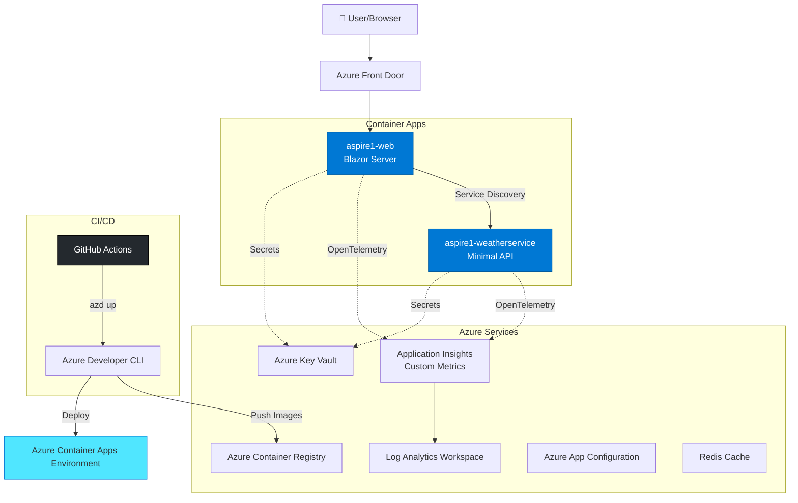
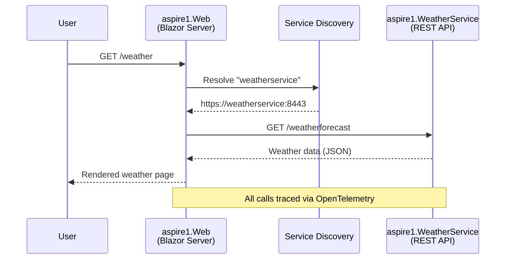
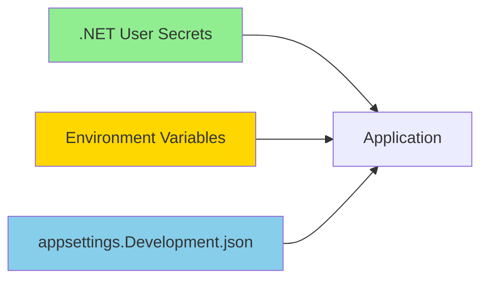
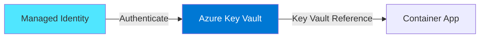
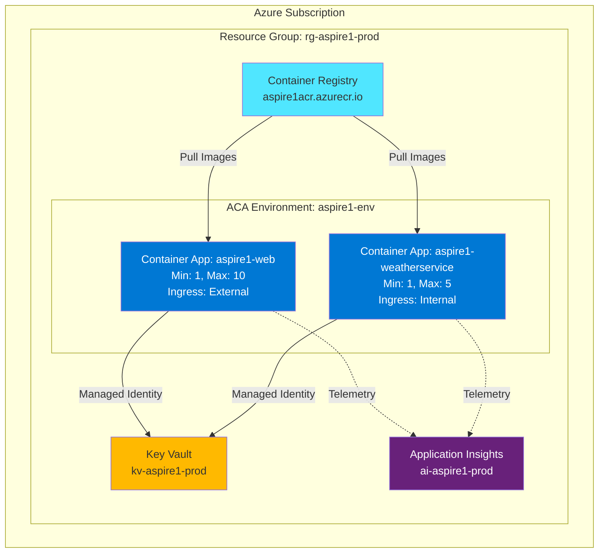
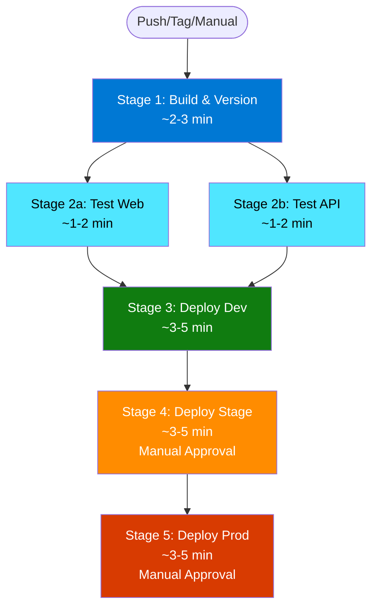
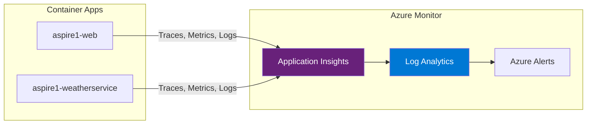
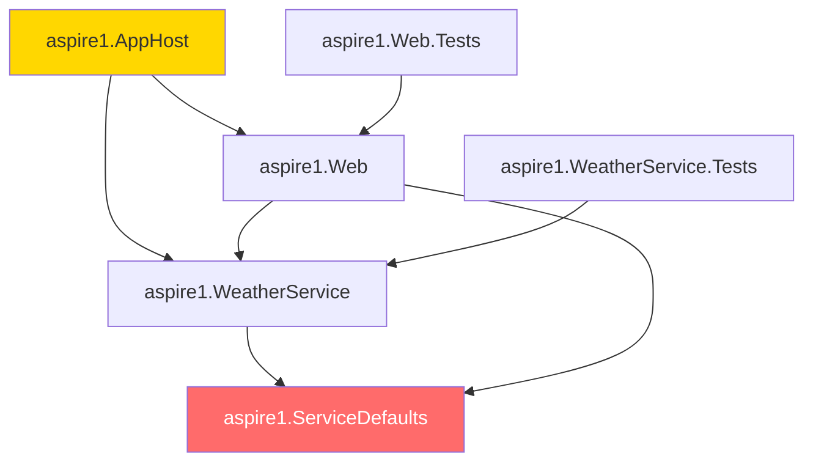

# Architecture Documentation - aspire1

> **Version:** 1.0.0
> **Last Updated:** December 12, 2025
> **Stack:** .NET Aspire 9.0, .NET 9.0, Azure Container Apps

## 🎯 High-Level Architecture



## 📊 Component Matrix

| Component                         | Type          | Port(s)          | Dependencies                | Health Endpoint               | Container Image                     |
| --------------------------------- | ------------- | ---------------- | --------------------------- | ----------------------------- | ----------------------------------- |
| **aspire1.Web**                   | Blazor Server | 8080, 8443       | aspire1.WeatherService      | `/health`                     | `aspire1-web:{version}`             |
| **aspire1.WeatherService**        | Minimal API   | 8080, 8443       | aspire1.ServiceDefaults, Redis, Azure App Config | `/health`, `/health/detailed` | `aspire1-weatherservice:{version}` |
| **aspire1.ServiceDefaults**       | Class Library | N/A              | -                           | N/A                           | N/A                                 |
| **aspire1.AppHost**               | Orchestrator  | 5000 (dashboard) | All projects                | N/A                           | N/A                                 |
| **aspire1.Web.Tests**             | Test Project  | N/A              | aspire1.Web                 | N/A                           | N/A                                 |
| **aspire1.WeatherService.Tests**  | Test Project  | N/A              | aspire1.WeatherService      | N/A                           | N/A                                 |

### Additional Endpoints

| Service                | Endpoint               | Purpose                                        |
| ---------------------- | ---------------------- | ---------------------------------------------- |
| aspire1.WeatherService | `GET /`                | Service status message                         |
| aspire1.WeatherService | `GET /weatherforecast` | Weather data API with Redis caching and humidity |
| aspire1.WeatherService | `GET /version`         | Version + commit SHA for deployment tracking   |
| aspire1.WeatherService | `GET /health/detailed` | Enhanced health with version and feature flags |

## 📊 Custom Telemetry & Observability

### Application Insights Custom Metrics

The solution includes **6 custom metrics** tracked via OpenTelemetry:

| Metric                | Type      | Tags                      | Purpose                                                                |
| --------------------- | --------- | ------------------------- | ---------------------------------------------------------------------- |
| `counter.clicks`      | Counter   | page, range               | Tracks Counter page button clicks by range (0-10, 11-50, 51-100, 100+) |
| `weather.api.calls`   | Counter   | endpoint, feature_enabled | Total weather API call volume                                          |
| `weather.sunny.count` | Counter   | temperature_range         | Counts sunny forecasts by temp range (<0, 0-15, 16-25, >25°C)          |
| `cache.hits`          | Counter   | entity                    | Cache hit count by entity type                                         |
| `cache.misses`        | Counter   | entity                    | Cache miss count by entity type                                        |
| `api.call.duration`   | Histogram | endpoint, success         | API call latency distribution in milliseconds                          |

**Meter Name:** `aspire1.metrics`

**Implementation:** See [`aspire1.ServiceDefaults/ApplicationMetrics.cs`](aspire1.ServiceDefaults/ApplicationMetrics.cs)

### Pre-Built Dashboard

Automatically deployed Azure Portal dashboard includes:

- Counter clicks by range (bar chart)
- Sunny forecasts over time by temperature (line chart)
- Cache hit/miss ratio (pie chart)
- API call duration percentiles P50/P95/P99 (line chart)
- Weather API call volume (area chart)

**Location:** `infra/dashboard.bicep`

### Alert Rules

Automated alerts with email notifications:

1. **Cache Miss Rate >50%** (Severity: Warning) - 5-minute window
2. **API Errors >5/min** (Severity: Error) - Real-time
3. **API Latency P95 >1000ms** (Severity: Warning) - 10-minute window

**Location:** `infra/alerts.bicep`

### Offline-First Design

✅ Application runs completely disconnected from Azure
✅ Single startup log message when App Insights unavailable
✅ Graceful degradation with try-catch wrapper
✅ Local telemetry via Aspire Dashboard

## 🏗️ Project Structure

```
aspire1/
├── aspire1.AppHost/                  # Orchestration & service discovery
│   ├── AppHost.cs                    # Defines service topology
│   ├── appsettings.json              # Environment-agnostic config
│   └── ARCHITECTURE.md               # AppHost-specific architecture
│
├── aspire1.WeatherService/           # Backend REST API
│   ├── Program.cs                    # API endpoints & middleware
│   ├── Services/
│   │   └── CachedWeatherService.cs   # Redis-backed caching service
│   ├── appsettings.json              # Default configuration
│   └── ARCHITECTURE.md               # API service architecture
│
├── aspire1.Web/                      # Blazor Server frontend
│   ├── Program.cs                    # Web app configuration
│   ├── WeatherApiClient.cs           # Typed HTTP client
│   ├── Components/                   # Blazor components
│   │   ├── Pages/                    # Routable pages
│   │   │   ├── Counter.razor         # Counter demo with metrics
│   │   │   ├── Weather.razor         # Weather forecast display
│   │   │   ├── FeatureDemo.razor     # Feature flag demo
│   │   │   └── ...
│   │   └── Layout/                   # Layout components
│   └── ARCHITECTURE.md               # Web service architecture
│
├── aspire1.ServiceDefaults/          # Shared Aspire defaults
│   ├── Extensions.cs                 # OpenTelemetry, health, resilience
│   ├── ApplicationMetrics.cs         # Custom metrics definitions
│   └── ARCHITECTURE.md               # Service defaults architecture
│
├── aspire1.WeatherService.Tests/     # API service unit tests
│   └── Services/
│       └── CachedWeatherServiceTests.cs  # Cache service tests
│
├── aspire1.Web.Tests/                # Web frontend unit tests
│   └── WeatherApiClientTests.cs      # HTTP client tests
│
├── .github/
│   └── workflows/
│       └── deploy.yml                # CI/CD pipeline (GitHub Actions)
│
├── Directory.Build.props             # Centralized versioning with MinVer
├── azure.yaml                        # Azure Developer CLI manifest
└── ARCHITECTURE.md                   # This file
```

## 🔄 Service Discovery & Communication

### Internal Communication Flow



### Service Discovery Configuration

- **Scheme:** `https+http://` (prefers HTTPS, falls back to HTTP)
- **Internal DNS:** `weatherservice` resolves within ACA Environment
- **External access:** Only `aspire1-web` exposed via ingress
- **Resilience:** Polly with retry, circuit breaker, timeout (from ServiceDefaults)

## 🔐 Secrets & Configuration Management

### Local Development



**Commands:**

```bash
# Set local secrets
dotnet user-secrets set "ConnectionStrings:MyDb" "..." --project aspire1.WeatherService

# Run locally
dotnet run --project aspire1.AppHost
```

### Azure Production



**Configuration:**

- Secrets stored in **Azure Key Vault** only
- Container Apps use **managed identity** to access Key Vault
- Connection strings injected as environment variables via Key Vault references
- **NEVER** commit secrets to git (protected by `.gitignore`)

### Configuration Priority (Highest to Lowest)

1. Environment variables (set by AppHost or ACA)
2. Azure Key Vault references
3. `appsettings.{Environment}.json`
4. `appsettings.json`
5. User Secrets (local dev only)

## 🚀 Deployment Topology

### Azure Container Apps Environment



### Container App Configuration

| Setting           | aspire1-web                    | aspire1-weatherservice        |
| ----------------- | ------------------------------ | ----------------------------- |
| **Ingress**       | External (HTTPS)               | Internal only                 |
| **Min Replicas**  | 1                              | 1                             |
| **Max Replicas**  | 10                             | 5                             |
| **CPU**           | 0.5 cores                      | 0.25 cores                    |
| **Memory**        | 1.0 Gi                         | 0.5 Gi                        |
| **Health Probe**  | `/health`                      | `/health`                     |
| **Revision Mode** | Single                         | Single                        |
| **Scale Rule**    | HTTP (100 concurrent requests) | HTTP (50 concurrent requests) |

## 📦 CI/CD Pipeline

### Multistage Pipeline Architecture

The project uses a **5-stage pipeline** with parallelization for optimal deployment speed:



**Total Pipeline Time:**
- **Dev only (main branch):** ~6-10 minutes
- **Dev → Stage → Prod (tag):** ~15-20 minutes (including approvals)

### Pipeline Workflows

| Workflow | File | Purpose |
|----------|------|---------|
| **Multistage Deploy** | `multistage-deploy.yml` | Production pipeline with 3 environments, parallel testing, manual approvals |
| **Simple Deploy** | `deploy.yml` | Original single-environment deployment for quick iterations |

### Trigger Conditions

#### Multistage Pipeline

| Event               | Branch/Tag       | Deploys To          | Approval Required |
| ------------------- | ---------------- | ------------------- | ----------------- |
| `push`              | `main`           | Dev only            | None              |
| `push`              | `v*` tag         | Dev → Stage → Prod  | Stage, Prod       |
| `workflow_dispatch` | Any              | Selected env        | Per environment   |

#### Environment Configuration

| Environment | Auto-Deploy | Approval | Wait Time | Purpose                    |
|-------------|-------------|----------|-----------|----------------------------|
| **Dev**     | Yes (main)  | None     | 0 min     | Continuous integration     |
| **Stage**   | After dev   | 1-2      | 0 min     | Pre-production testing     |
| **Prod**    | After stage | 2+       | 5 min     | Production releases        |

### Pipeline Stages

1. **Build & Version**
   - Restore NuGet packages (with caching)
   - Build solution in Release mode
   - Extract version with MinVer
   - Upload build artifacts

2. **Parallel Testing**
   - Run Web.Tests (parallel)
   - Run WeatherService.Tests (parallel)
   - Publish test results with coverage

3. **Deploy Dev** (automatic on main)
   - Azure OIDC authentication
   - Configure azd environment
   - Provision + deploy with `azd up`
   - Verify health endpoints

4. **Deploy Stage** (manual approval)
   - Requires dev deployment success
   - Manual approval from 1-2 reviewers
   - Separate subscription/service principal
   - Full environment verification

5. **Deploy Prod** (manual approval + wait)
   - Requires stage deployment success
   - Manual approval from 2+ reviewers
   - 5-minute cooling period
   - Post-deployment checklist

### Security & Authentication

- **OIDC Federation:** No secrets stored in GitHub (only client IDs)
- **Environment-specific service principals:** Separate identity per environment
- **Least-privilege access:** Contributor role scoped to subscription
- **Branch protection:** Required for production deployments
- **Audit trail:** All approvals and deployments logged

### azd Hooks (azure.yaml)

1. **preprovision**: Extract version with MinVer, set `VERSION` and `COMMIT_SHA`
2. **postprovision**: Configure Azure App Configuration with feature flags
3. **prepackage**: Tag container images with version from registry endpoint
4. **postdeploy**: Verify deployment, log version info

### Deployment Speed Optimizations

- **NuGet package caching:** Restore time reduced by ~60%
- **Parallel testing:** Web + API tests run simultaneously
- **Build artifact reuse:** Single build used across all deployments
- **Azure CLI OIDC:** No secret rotation overhead
- **Incremental deployments:** Only changed containers rebuilt

### Setup Documentation

See [`.github/workflows/PIPELINE_SETUP.md`](.github/workflows/PIPELINE_SETUP.md) for:
- Environment creation and configuration
- Azure service principal setup with OIDC
- GitHub secrets and variables configuration
- Usage examples and troubleshooting

## 📈 Observability & Monitoring

### OpenTelemetry Stack



### Instrumentation (ServiceDefaults)

- **Traces:** ASP.NET Core, HttpClient, custom sources
- **Metrics:** ASP.NET Core, HttpClient, Runtime (GC, threads, exceptions)
- **Logs:** Structured logging with scopes, formatted messages
- **Health Checks:** `/health` (all checks), `/alive` (liveness only)
- **Filters:** Health check endpoints excluded from tracing

### Key Metrics to Monitor

| Metric                      | Alert Threshold | Purpose                 |
| --------------------------- | --------------- | ----------------------- |
| HTTP Request Duration (P95) | >2 seconds      | Latency spike detection |
| HTTP Request Rate           | N/A             | Traffic patterns        |
| Exception Rate              | >5% of requests | Error rate monitoring   |
| Container CPU %             | >80% sustained  | Scale-out trigger       |
| Container Memory %          | >85% sustained  | Memory pressure         |
| Health Check Failures       | >3 consecutive  | Service degradation     |

### Log Analytics Queries

```kql
// All traces for a specific version
traces
| where customDimensions.version == "1.0.0"
| project timestamp, message, severityLevel

// Failed requests with version context
requests
| where success == false
| extend version = tostring(customDimensions.version)
| project timestamp, name, resultCode, duration, version
| order by timestamp desc

// Exception analysis by service
exceptions
| extend service = tostring(customDimensions.service)
| summarize count() by service, type
```

## 🛡️ Resilience & Scaling

### Resilience Patterns (via ServiceDefaults)

- **Retry Policy:** 3 attempts with exponential backoff
- **Circuit Breaker:** Opens after 5 consecutive failures
- **Timeout:** 10 seconds per request
- **Bulkhead Isolation:** Limit concurrent requests

### KEDA Autoscaling Rules

| Service                | Trigger               | Scale In Delay | Scale Out Delay |
| ---------------------- | --------------------- | -------------- | --------------- |
| aspire1-web            | HTTP (100 concurrent) | 5 min          | 30 sec          |
| aspire1-weatherservice | HTTP (50 concurrent)  | 5 min          | 30 sec          |

**Cold Start Strategy:**

- Min replicas = 1 (always warm)
- Pre-warmed instances reduce P99 latency

## 🔧 Troubleshooting Cheat Sheet

### Local Development

```bash
# View Aspire dashboard
dotnet run --project aspire1.AppHost
# Navigate to: http://localhost:5000

# Check service health
curl http://localhost:{port}/health

# View version info
curl http://localhost:{port}/version

# Tail logs
dotnet watch --project aspire1.WeatherService
```

### Azure (Production)

```bash
# Show deployed resources
azd show

# Get container app logs (last 10 min)
az containerapp logs show \
  --name aspire1-weatherservice \
  --resource-group rg-aspire1-prod \
  --follow

# Check container app status
az containerapp show \
  --name aspire1-weatherservice \
  --resource-group rg-aspire1-prod \
  --query "properties.runningStatus"

# Test version endpoint
curl https://aspire1-weatherservice.{aca-env}.eastus.azurecontainerapps.io/version

# View Application Insights live metrics
az monitor app-insights component show \
  --app ai-aspire1-prod \
  --resource-group rg-aspire1-prod
```

### Common Issues

| Symptom                    | Likely Cause              | Fix                                                                                  |
| -------------------------- | ------------------------- | ------------------------------------------------------------------------------------ |
| 503 Service Unavailable    | Container not ready       | Check `/health` endpoint, review startup logs                                        |
| Service discovery fails    | Incorrect service name    | Verify `builder.AddProject<>()` name matches HttpClient base address                 |
| Secrets not loading        | Key Vault access denied   | Verify managed identity has `Get Secret` permission                                  |
| MinVer shows "0.0.0-alpha" | No git tags               | Run `git tag v1.0.0` and rebuild                                                     |
| CI/CD fails at azd step    | Missing Azure credentials | Verify GitHub secrets: `AZURE_CLIENT_ID`, `AZURE_TENANT_ID`, `AZURE_SUBSCRIPTION_ID` |

## 📚 Versioning Strategy

### SemVer with MinVer

- **Source:** Git tags (`v{major}.{minor}.{patch}`)
- **Format:** `1.2.3+commitsha`
- **Local builds:** `1.0.0-local+commitsha`
- **CI builds:** Exact version from tag

**Bump Version:**

```bash
# Patch: v1.0.0 → v1.0.1
git tag v1.0.1

# Minor: v1.0.1 → v1.1.0
git tag v1.1.0

# Major: v1.1.0 → v2.0.0
git tag v2.0.0

# Push and trigger CI/CD
git push origin v2.0.0
```

### Container Image Tags

- **Production:** `aspire1-weatherservice:1.2.3`
- **Latest:** `aspire1-weatherservice:latest` (always points to latest release)
- **Rollback:** `azd deploy --from-revision aspire1-weatherservice--1-2-2`

## 🎯 Next Steps & Enhancements

### Planned Features

- [x] Implement Azure App Configuration for feature flags
- [x] Add Redis distributed caching with offline-first fallback
- [x] Add humidity data to weather forecasts with feature flag control
- [x] Implement card-based UI for weather display
- [ ] Add Azure SQL Database with EF Core
- [ ] Multi-region deployment with Front Door
- [ ] Dapr integration for pub/sub and state management
- [x] Unit tests with xUnit, FluentAssertions, and NSubstitute
- [ ] Integration tests with Aspire.Hosting.Testing

### Production Readiness Checklist

- [x] Centralized versioning (MinVer)
- [x] Secrets in Key Vault only
- [x] OpenTelemetry to Application Insights
- [x] Health checks on all services
- [x] Managed identity for all Azure resources
- [x] CI/CD pipeline with GitHub Actions
- [x] Unit test coverage (>80% target)
- [ ] Custom domain + SSL certificate
- [ ] Azure Front Door for CDN + WAF
- [ ] Backup and disaster recovery plan
- [ ] Load testing (target: 1000 req/sec sustained)

## 🧪 Testing Strategy

### Unit Tests

The solution includes comprehensive unit tests following industry best practices:

**Test Framework Stack:**

- **xUnit 2.9.3** - Test framework
- **FluentAssertions 6.12.0** - Readable assertions
- **NSubstitute 5.1.0** - Mocking framework
- **coverlet.collector 6.0.4** - Code coverage

**Test Projects:**

| Project                       | Tests | Coverage | Description                            |
| ----------------------------- | ----- | -------- | -------------------------------------- |
| aspire1.WeatherService.Tests  | 7     | >80%     | Cache service logic and error handling |
| aspire1.Web.Tests             | 10    | >80%     | HTTP client behavior and edge cases    |

**Test Naming Convention:**

```
[MethodName]_[Scenario]_[ExpectedResult]
Example: GetWeatherAsync_SuccessfulResponse_ReturnsForecasts
```

**Run Tests:**

```bash
# Run all tests
dotnet test

# Run specific project tests
dotnet test aspire1.WeatherService.Tests
dotnet test aspire1.Web.Tests

# Run with coverage
dotnet test --collect:"XPlat Code Coverage"
```

**Test Coverage Highlights:**

- ✅ Cache hit/miss scenarios
- ✅ Cache read/write failures with graceful degradation
- ✅ HTTP client success/error responses
- ✅ Cancellation token handling
- ✅ Edge cases (empty data, various counts)
- ✅ Temperature conversion validation

**Key Test Patterns:**

```csharp
// WeatherService: Mocking IDistributedCache
_mockCache.GetAsync(Arg.Any<string>(), Arg.Any<CancellationToken>())
    .Returns(cachedData);

// Web: Mocking HttpMessageHandler
var handler = new MockHttpMessageHandler(HttpStatusCode.OK, json);
var httpClient = new HttpClient(handler);

// Assertions with FluentAssertions
result.Should().NotBeNull();
result.Should().HaveCount(5);
forecast.TemperatureC.Should().Be(20);
```

### Integration Tests (Planned)

Future integration tests will use `Aspire.Hosting.Testing` to:

- Spin up full distributed application with real containers
- Test service-to-service communication via service discovery
- Verify health endpoints and OpenTelemetry traces
- Validate Redis caching end-to-end

## 🔗 Dependencies & Change Impact Analysis

### Component Dependency Graph



### Files That Can Be Changed in Isolation

These files/paths can be modified without breaking other parts of the application:

#### ✅ Safe to Change Independently

| File/Path | What It Controls | Why It's Safe |
| --- | --- | --- |
| `aspire1.Web/Components/Pages/*.razor` | Individual page UI and logic | Pages are isolated; changing one doesn't affect others |
| `aspire1.Web/wwwroot/*` | Static assets (CSS, JS, images) | Web assets don't impact API or service logic |
| `aspire1.WeatherService/Services/CachedWeatherService.cs` | Internal caching logic | Implementation detail; API contract unchanged |
| `*.Tests/**` | Test code | Tests don't affect production code |
| `ARCHITECTURE.md` files | Documentation only | No code impact |
| `README.md`, `TELEMETRY.md` | Documentation | No code impact |
| `infra/dashboard.bicep` | Azure Dashboard definition | UI-only; doesn't affect app logic |
| `infra/alerts.bicep` | Alert rules | Monitoring-only; doesn't affect app behavior |
| `.github/workflows/*.yml` | CI/CD pipelines | Deployment process; doesn't change code |
| `scripts/*` | Build/deployment scripts | Tooling-only |

#### ⚠️ Requires Coordination (Change Multiple Files)

| File/Path | What It Controls | What Else Needs Updating |
| --- | --- | --- |
| `aspire1.ServiceDefaults/Extensions.cs` | OpenTelemetry, health checks, resilience | All services depend on this; test thoroughly |
| `aspire1.ServiceDefaults/ApplicationMetrics.cs` | Custom metric definitions | Update both WeatherService and Web if metrics change |
| `aspire1.AppHost/AppHost.cs` | Service registration and references | Update if service names or dependencies change |
| `aspire1.WeatherService/Program.cs` (endpoints) | API contract | Update `WeatherApiClient.cs` if endpoints change |
| `aspire1.Web/WeatherApiClient.cs` | HTTP client interface | Must match WeatherService endpoints |
| `Directory.Build.props` | Versioning and shared MSBuild props | Affects all projects |
| `azure.yaml` | Azure deployment manifest | Update if services, resources, or hooks change |

### Breaking Change Warnings

#### 🚨 HIGH RISK: Changes That Break Other Components

| What You Change | What It Breaks | How to Prevent |
| --- | --- | --- |
| **Service name in AppHost** (e.g., "weatherservice") | `WeatherApiClient` can't resolve service | Keep service names stable; coordinate with all consumers |
| **Endpoint paths** in `WeatherService/Program.cs` | `WeatherApiClient` 404 errors | Version endpoints (e.g., `/v1/weatherforecast`) or coordinate deployment |
| **WeatherForecast record structure** | JSON serialization fails between services | Use API versioning; add fields without removing old ones |
| **ServiceDefaults health check tags** | Container Apps health probes fail | Test health endpoints after changes |
| **OpenTelemetry meter name** | Metrics disappear from Application Insights | Coordinate with monitoring team before changing |
| **Redis cache key format** | Cache misses (not breaking, but performance hit) | Use versioned cache keys |
| **Feature flag names** | Features break if app expects different names | Coordinate with config team |
| **Azure resource names in `azd`** | Deployment fails; recreates resources | Never change in production; use new environment |

### Dependency Contracts (Must Keep Stable)

#### 1. Service Discovery Contract
- **Service name**: `"weatherservice"` in AppHost
- **Used by**: `WeatherApiClient` in aspire1.Web
- **Impact**: Hard failure if changed without coordination

#### 2. API Endpoint Contract
- **Endpoints**: `GET /weatherforecast`, `GET /version`, `GET /health/detailed`
- **Used by**: `WeatherApiClient.GetWeatherAsync()`
- **Impact**: 404 errors if paths change

#### 3. Data Transfer Objects
- **Type**: `WeatherForecast(DateOnly Date, int TemperatureC, string? Summary)`
- **Used by**: Both WeatherService and Web (deserialization)
- **Impact**: JSON deserialization fails if structure changes

#### 4. ServiceDefaults API
- **Methods**: `AddServiceDefaults()`, `MapDefaultEndpoints()`, `ConfigureOpenTelemetry()`
- **Used by**: All services (WeatherService, Web)
- **Impact**: Build errors if signatures change

#### 5. ApplicationMetrics API
- **Metrics**: `CounterClicks`, `WeatherApiCalls`, `SunnyForecasts`, `CacheHits`, `CacheMisses`, `ApiCallDuration`
- **Used by**: WeatherService, Web (Counter.razor, WeatherApiClient)
- **Impact**: Metrics stop flowing to Application Insights

#### 6. AppHost Resource References
- **Resources**: `appinsights`, `appconfig`, `cache` (Redis)
- **Used by**: Both WeatherService and Web via `WithReference()`
- **Impact**: Connection strings not injected; services fail to connect

### Safe Refactoring Strategies

#### Adding New Features
✅ **Safe**:
- Add new endpoints without removing old ones
- Add new optional fields to DTOs (use nullable types)
- Add new pages to Web
- Add new metrics
- Add new feature flags

❌ **Risky**:
- Removing endpoints (breaks clients)
- Changing DTO field names (breaks serialization)
- Removing metrics (breaks dashboards)

#### Changing Implementations
✅ **Safe**:
- Change internal `CachedWeatherService` logic
- Change page UI/styles
- Change cache expiration times
- Change health check logic (if health still returns 200)

❌ **Risky**:
- Changing health endpoint paths (breaks Container Apps probes)
- Changing meter names (breaks Application Insights queries)
- Changing service names (breaks service discovery)

#### Database/State Changes
✅ **Safe** (when implemented):
- Add new columns (with defaults)
- Add new tables
- Add indexes

❌ **Risky**:
- Drop columns (use soft delete first)
- Change primary keys
- Change schema without migration

### Testing Change Impact

Before making changes, verify impact with these commands:

```bash
# 1. Find all references to a service name
grep -r "weatherservice" --include="*.cs" --include="*.razor"

# 2. Find all API client usages
grep -r "WeatherApiClient" --include="*.cs" --include="*.razor"

# 3. Find all metric references
grep -r "ApplicationMetrics" --include="*.cs" --include="*.razor"

# 4. Build all projects to check for breaking changes
dotnet build aspire1.sln

# 5. Run all tests to verify contracts
dotnet test aspire1.sln

# 6. Check AppHost references
cat aspire1.AppHost/AppHost.cs | grep -E "AddProject|WithReference"
```

### Change Approval Matrix

| Change Type | Requires Approval | Testing Required |
| --- | --- | --- |
| UI-only changes (Razor, CSS) | No | Manual UI testing |
| Internal implementation (CachedWeatherService) | No | Unit tests |
| New endpoints (additive) | Review | Integration tests |
| Endpoint path changes | Yes | Full regression |
| DTO structure changes | Yes | API compatibility tests |
| ServiceDefaults changes | Yes | All services smoke test |
| AppHost service names | Yes | Service discovery tests |
| Infrastructure (Bicep) | Yes | Deploy to dev first |

## 📖 References

- [.NET Aspire Documentation](https://learn.microsoft.com/dotnet/aspire/)
- [Azure Container Apps](https://learn.microsoft.com/azure/container-apps/)
- [Azure Developer CLI](https://learn.microsoft.com/azure/developer/azure-developer-cli/)
- [xUnit Documentation](https://xunit.net/)
- [FluentAssertions Documentation](https://fluentassertions.com/)
- [MinVer](https://github.com/adamralph/minver)
- [OpenTelemetry .NET](https://opentelemetry.io/docs/languages/net/)

## 🤖 GitHub Copilot Integration

This repository includes **specialized GitHub Copilot configuration** that transforms your AI assistant into an architecture-aware expert who enforces patterns, prevents anti-patterns, and accelerates development workflows.

### Repository Instructions

#### Primary Configuration: [`.github/copilot-instructions.md`](.github/copilot-instructions.md)

Teaches GitHub Copilot the architectural patterns and constraints of this .NET Aspire solution:

**Key Behaviors:**
- 📖 **Architecture-First Development** - Always loads relevant `ARCHITECTURE.md` files before suggesting code
- 🎯 **Pattern Enforcement** - Suggests `WithReference()` for service discovery, never hard-coded URLs
- 🚫 **Anti-Pattern Prevention** - Blocks hard-coded secrets, missing health checks, wrong endpoint patterns
- ✅ **Example-Based Learning** - References "Good vs Bad Implementations" from architecture docs
- 💡 **Context Scoping** - Loads only relevant docs based on task (don't load Web docs when changing API)

**What Copilot Learns:**
- Service discovery patterns (`WithReference()` vs hard-coded URLs)
- Health check conventions (`/health/detailed` with version metadata)
- Secrets management (Key Vault references, never in `appsettings.json`)
- Resilience patterns (ServiceDefaults, retry/circuit breaker)
- OpenTelemetry configuration (exclude health endpoints from traces)
- Deployment patterns (Azure Container Apps, azd-first approach)
- Testing strategies (xUnit, FluentAssertions, integration test patterns)

#### Azure-Specific Guidance: [`.github/instructions/azure.instructions.md`](.github/instructions/azure.instructions.md)

Ensures Azure recommendations match the target deployment platform:

**Enforced Patterns:**
- ☁️ **Azure Container Apps Environment** - Primary target (never suggests App Service or AKS)
- 🛠️ **Azure Developer CLI (azd)** - Exclusive deployment tool
- 🔑 **Key Vault + Managed Identity** - Secrets management approach
- 📊 **Application Insights** - Observability and custom metrics patterns
- 📦 **Bicep Templates** - Infrastructure as Code structure in `/infra/`

### Custom Copilot Agents

**Location:** `.github/agents/` directory

Three specialized agents handle specific development workflows:

| Agent | File | Primary Use Case | Invoke With |
| --- | --- | --- | --- |
| **@docs** | [`docs.agent.md`](.github/agents/docs.agent.md) | Documentation generation with Mermaid diagrams, component matrices, troubleshooting guides | `@docs document Redis caching` |
| **@playwright-tester** | [`playwright-tester.agent.md`](.github/agents/playwright-tester.agent.md) | E2E test generation/debugging, semantic locator identification, Playwright MCP exploration | `@playwright-tester write weather API tests` |
| **@commit** | [`commit.agent.md`](.github/agents/commit.agent.md) | Conventional Commits, branch management, PR creation with changelogs | `@commit` (analyzes changes automatically) |

#### @docs Agent - Documentation Generation

**Capabilities:**
- Generates production-grade Markdown with Mermaid diagrams
- Creates component matrices (services, ports, dependencies, health endpoints)
- Includes "Good vs Bad" code examples for every pattern
- Outputs mkdocs-material or Docusaurus-ready structure
- Writes with confident, slightly sassy tone (matches repo style)

**When to Use:**
- Creating new `ARCHITECTURE.md` files for services
- Documenting complex integrations (Redis, App Configuration, Key Vault)
- Generating sequence diagrams for API flows
- Writing deployment or troubleshooting guides

#### @playwright-tester Agent - E2E Test Automation

**Capabilities:**
- Uses Playwright MCP to explore websites like a real user
- Identifies semantic locators (`getByRole`, `getByLabel`) over CSS selectors
- Generates TypeScript tests following project structure
- Debugs failures using screenshots and `execute/testFailure`
- Targets Chromium browser per project configuration

**When to Use:**
- Writing new E2E tests for Blazor UI or Minimal APIs
- Fixing failing tests after UI/API changes
- Exploring pages to find correct locators
- Validating integration between Web and WeatherService

#### @commit Agent - Git Workflow Automation

**Capabilities:**
- Auto-stages changes with `git add -A`
- Prevents direct commits to `main` (creates feature branches)
- Analyzes code diffs to infer commit type (feat/fix/docs/chore/test)
- Infers scopes from file paths (`api`, `web`, `apphost`, `test`, `infra`, `docs`)
- Generates Conventional Commit messages with detailed bodies
- Creates PRs with emojis, changelogs, and testing details

**When to Use:**
- Any time you're ready to commit (replaces manual `git commit`)
- Creating pull requests with auto-generated descriptions
- When you've made changes but forgot what you did
- Enforcing team commit message conventions

**Scope Inference Rules:**
- `aspire1.WeatherService/` → `(api)`
- `aspire1.Web/` → `(web)`
- `aspire1.AppHost/` → `(apphost)`
- `*.Tests/` → `(test)`
- `infra/` → `(infra)`
- `.github/workflows/` → `(ci)`
- Root config files → `(root)`

### How This Improves Development

**1. Architecture Enforcement**

Copilot won't suggest anti-patterns because instructions teach it what NOT to do:

```csharp
// ❌ Copilot won't suggest this anymore
var httpClient = new HttpClient { BaseAddress = new Uri("https://localhost:7123") };

// ✅ Copilot suggests this instead (from copilot-instructions.md)
builder.AddProject<Projects.aspire1_Web>("webfrontend")
    .WithReference(weatherService);  // Service discovery!
```

**2. Context-Aware Suggestions**

When you ask to add a secret, Copilot loads the instructions first:

```bash
User: "Add database connection to WeatherService"

# Copilot process:
1. Loads .github/copilot-instructions.md
2. Reads secrets management section
3. Suggests Key Vault reference with managed identity
4. Shows example from instructions
5. Never suggests storing in appsettings.json
```

**3. Faster Onboarding**

New developers get instant guidance:
- Copilot explains patterns as it suggests code
- References architecture docs automatically
- Prevents common mistakes before they happen

**4. Specialized Workflows**

Right tool for the right job:
- Need docs? `@docs` generates Mermaid diagrams automatically
- Need tests? `@playwright-tester` explores the UI first
- Need to commit? `@commit` handles branch creation and message generation

**5. Consistency Across Team**

Everyone gets the same architectural guidance:
- No more "I didn't know we used Key Vault"
- No more hard-coded URLs sneaking into PRs
- Commit messages follow team conventions automatically

### Example Usage Scenarios

**Scenario 1: Adding a New API Endpoint**

```
User: "Add a new health check endpoint to WeatherService"

# Copilot loads aspire1.WeatherService/ARCHITECTURE.md
# Suggests:
app.MapGet("/health/detailed", (IConfiguration config) => new
{
    Status = "Healthy",
    Version = config["App:Version"],
    Timestamp = DateTime.UtcNow
});

# Matches existing pattern from architecture docs!
```

**Scenario 2: Storing Secrets**

```
User: "Store Redis connection string"

# Copilot loads copilot-instructions.md secrets section
# Suggests:

1. Local development:
   dotnet user-secrets set "ConnectionStrings:Redis" "localhost:6379"

2. Azure deployment:
   azd env set ConnectionStrings__Redis "@Microsoft.KeyVault(SecretUri=https://kv.vault.azure.net/secrets/redis-connection)"

3. Never add to appsettings.json!
```

**Scenario 3: Writing Documentation**

```
User: @docs document the session state management in Web frontend

# Agent explores aspire1.Web/ARCHITECTURE.md
# Generates:
- Mermaid diagram showing Browser → Blazor Server → Redis → Session State
- Component matrix with session configuration
- Good vs Bad examples (Redis-backed vs in-memory)
- Troubleshooting section for session loss issues
```

**Scenario 4: Debugging a Test**

```
User: @playwright-tester the counter button click test is failing

# Agent:
1. Navigates to http://localhost:5142/counter
2. Takes page snapshot
3. Identifies button: getByRole('button', { name: 'Click me' })
4. Reviews test-results/ screenshots
5. Suggests: "Add await page.waitForTimeout(500) before clicking to allow SignalR connection"
```

**Scenario 5: Committing Changes**

```
User: @commit

# Agent:
📦 Auto-staged 5 files
🛑 You're on main! Creating branch: feat/api-caching
✅ Tests passed (26/26)
📝 Generated commit:

feat(api): add redis caching to weather service

Implemented distributed caching with 5-minute expiration.
Added cache hit/miss metrics to Application Insights.

Files:
- aspire1.WeatherService/Services/CachedWeatherService.cs
- aspire1.WeatherService.Tests/Services/CachedWeatherServiceTests.cs

Commit? (yes/no)
```

### Configuration Files Structure

```
.github/
├── copilot-instructions.md          # Main architectural guidance
├── instructions/
│   └── azure.instructions.md        # Azure-specific patterns
└── agents/
    ├── docs.agent.md                # @docs agent configuration
    ├── playwright-tester.agent.md   # @playwright-tester agent
    └── commit.agent.md              # @commit agent
```

### Safe to Modify

These configuration files are **documentation-only** and safe to change without impacting production:

| File | Impact | Testing Required |
| --- | --- | --- |
| `.github/copilot-instructions.md` | Developer assistance only | None |
| `.github/instructions/*.md` | Developer assistance only | None |
| `.github/agents/*.agent.md` | Developer assistance only | None |

**Note:** Changes to instructions/agents affect Copilot behavior but have zero runtime impact on deployed applications.

### See Also

- Main README: [GitHub Copilot Integration & Custom Agents](README.md#-github-copilot-your-ai-pair-programmer-on-steroids)
- Individual agent documentation in [`.github/agents/`](.github/agents/) directory
- Testing documentation: [tests/README.md](tests/README.md) for Playwright integration with `@playwright-tester`

---

**Last Updated:** December 12, 2025
**Maintained by:** DevOps Team
**Review Cadence:** Every major version bump or architectural change
