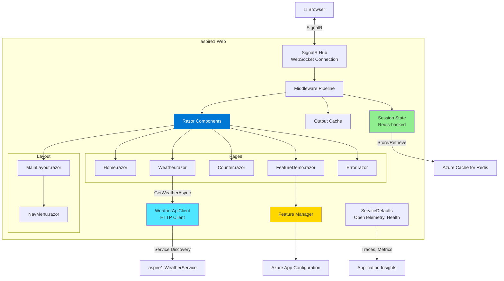
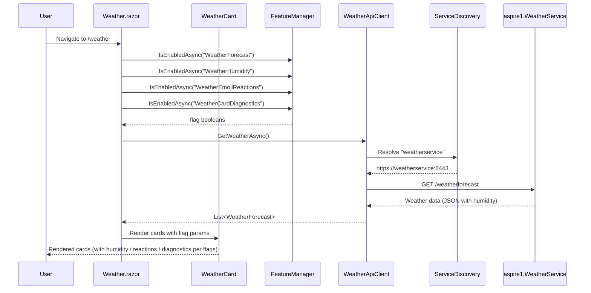
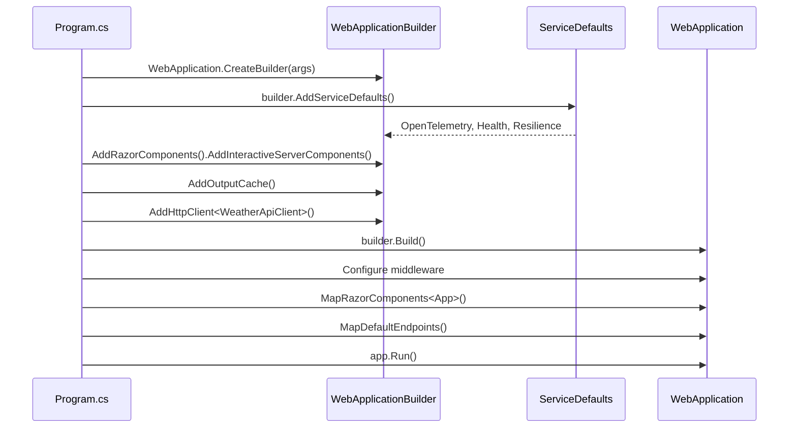

# Architecture - aspire1.Web

> **Component Type:** Blazor Server
> **Framework:** ASP.NET Core 9.0
> **Purpose:** Public-facing web frontend with server-side rendering, Redis session state, and feature flags

## 🎯 Overview

The **Web** project is a Blazor Server application that provides the user interface for the aspire1 solution. Key features:

- Server-side Blazor rendering (no WebAssembly)
- Real-time SignalR connection for UI updates
- HTTP client integration with service discovery
- Redis-backed session state with offline-first fallback
- Azure App Configuration for feature flags
- OpenTelemetry instrumentation (via ServiceDefaults)
- Output caching middleware registered (not used on feature-flag-driven pages — see [Output Caching and Feature Flags](#output-caching-and-feature-flags))

## 🏗️ Architecture



## 📄 Pages & Components

### `/` - Home.razor

**Purpose:** Landing page with welcome message

**Features:**

- Static content
- No API calls
- Demonstrates basic Blazor component

---

### `/counter` - Counter.razor

**Purpose:** Interactive counter demo (100% server-side)

**Features:**

- Server-side state management
- SignalR-based UI updates
- Demonstrates Blazor event handling

**Custom Telemetry:**

```csharp
private void IncrementCount()
{
    currentCount++;

    // Track counter clicks with range categorization
    ApplicationMetrics.CounterClicks.Add(1,
        new KeyValuePair<string, object?>("page", "counter"),
        new KeyValuePair<string, object?>("range",
            ApplicationMetrics.GetCountRange(currentCount)));
}
```

**Metric Tags:**

- `page`: "counter"
- `range`: "0-10", "11-50", "51-100", or "100+"

**Implementation:**

```razor
@page "/counter"

<h1>Counter</h1>
<p role="status">Current count: @currentCount</p>
<button @onclick="IncrementCount">Click me</button>

@code {
    private int currentCount = 0;

    private void IncrementCount()
    {
        currentCount++;
        // SignalR pushes update to browser automatically
    }
}
```

---

### `/weather` - Weather.razor

**Purpose:** Display weather forecast from API service with beautiful card-based UI

**Features:**

- HTTP client with service discovery
- Loading state
- Error handling
- Data binding
- Card-based UI with responsive grid layout
- Feature flag support for humidity display, emoji reactions, and diagnostics panel

**UI Components:**

- Uses `WeatherCard.razor` component for each day's forecast
- Responsive 3-column grid on large screens, 2-column on medium, 1-column on mobile
- Hover effects with elevation and shadow transitions
- Humidity display controlled by `WeatherHumidity` feature flag
- Emoji reaction bar controlled by `WeatherEmojiReactions` feature flag (off by default)
- Developer diagnostics panel controlled by `WeatherCardDiagnostics` feature flag (off by default)

**Flow:**



---

### `WeatherCard.razor` - Component

**Purpose:** Display individual daily weather forecast in a beautiful card format

**Features:**

- Responsive card layout with gradient header
- Temperature display (Celsius and Fahrenheit)
- Weather summary with icon placeholder
- Humidity display controlled by `WeatherHumidity` feature flag
- Emoji reaction bar controlled by `WeatherEmojiReactions` feature flag
- Developer diagnostics panel controlled by `WeatherCardDiagnostics` feature flag
- Real-time reaction count updates via `IReactionNotifier` subscription
- Hover effects with elevation and shadow transitions
- Bootstrap 5 card styling with custom enhancements

**Component Properties:**

```csharp
[Parameter]
public WeatherForecast? Forecast { get; set; }

[Parameter]
public bool ShowHumidity { get; set; }

[Parameter]
public bool ShowReactions { get; set; }

[Parameter]
public bool ShowDiagnostics { get; set; }

/// <summary>Mirrors the WeatherHumidity flag state so the diagnostics panel can report it accurately.</summary>
[Parameter]
public bool HumidityEnabled { get; set; }
```

**Feature Flag Integration:**

`Weather.razor` checks all three feature flags once during `OnInitializedAsync` and passes scalar booleans to each card. This is more efficient than each card injecting `IFeatureManager` directly.

```csharp
// In Weather.razor OnInitializedAsync
showHumidity    = await FeatureManager.IsEnabledAsync("WeatherHumidity");
showReactions   = await FeatureManager.IsEnabledAsync("WeatherEmojiReactions");
showDiagnostics = await FeatureManager.IsEnabledAsync("WeatherCardDiagnostics");

// Passed to each card
<WeatherCard Forecast="@forecast"
             ShowHumidity="@showHumidity"
             ShowReactions="@showReactions"
             ShowDiagnostics="@showDiagnostics"
             HumidityEnabled="@showHumidity" />
```

**Real-Time Reaction Updates:**

`WeatherCard` implements `IDisposable` and subscribes to `IReactionNotifier` on first render. When any circuit submits a reaction, `ReactionService` calls `IReactionNotifier.NotifyAsync`, which fans out to all subscribed cards for that date.

```csharp
protected override Task OnAfterRenderAsync(bool firstRender)
{
    if (firstRender && Forecast != null)
    {
        _handler = HandleReactionUpdateAsync;
        Notifier.Subscribe(_handler);
    }
    return Task.CompletedTask;
}

public void Dispose()
{
    if (_handler != null)
        Notifier.Unsubscribe(_handler);
}
```

**Diagnostics Panel (dev-only):**

When `ShowDiagnostics` is `true`, a collapsible `<details>` panel renders below the card body showing:

- Date key (ISO 8601)
- Temperature values (°C / °F)
- Humidity, summary, and temperature category
- Current feature flag states for all three weather flags
- Metric event names emitted by this card
- Cache/source status note (tracked server-side only via `cache.hits`/`cache.misses`)

**Styling:**

- Custom CSS classes: `.weather-card`, `.weather-temp`, `.weather-summary`, `.humidity-info`, `.reaction-bar`, `.weather-diag-panel`, `.weather-diag-table`
- Card header with blue gradient background
- Large temperature display with secondary unit label
- Humidity badge with light blue background (when enabled)
- Smooth transitions for hover effects

---

### WeatherCard Animations

**Purpose:** Dynamically animate weather cards with CSS-based animations that reflect the current forecast temperature range

**Temperature-to-Animation Mapping:**

| Temperature Range | CSS Class | Animation | Decorative Emojis | Colors |
|---|---|---|---|---|
| < 0°C | `.weather-card--freezing` | ❄️ Falling snowflakes (4s linear) | ❄️ | Ice blue (#B4DCFF), white |
| 0–15°C | `.weather-card--chilly` | 🌧️ Gentle rain droplets (3s ease-in-out) | 🌧️ | Slate gray (#A9A9A9), soft blue (#C0C0C0) |
| 16–25°C | `.weather-card--mild` | ☀️ Floating sun and clouds (5s/6s ease-in-out) | ☀️☁️ | Sky blue (#87CEEB), gold (#FFD700) |
| 26–40°C | `.weather-card--hot` | 🔥 Heat shimmer waves (2s ease-in-out) | 🔥 | Orange (#FFA500), amber (#FF8000) |
| > 40°C | `.weather-card--scorching` | 🌋 Intense distortion (1.5s cubic-bezier) | 🌋 | Deep red (#DC143C), fire |

**Implementation Details:**

- **Temperature Detection:** `GetTemperatureClass()` method in `WeatherCard.razor` uses a C# switch expression to map temperature values to CSS class names
- **CSS Classes:** Defined in `app.css` with pure CSS animations using `@keyframes`
- **Decorative Elements:** Emoji content added via CSS `::before` and `::after` pseudo-elements (accessible, no screen reader interference)
- **Position:** Absolute positioning with `z-index: 1` prevents layout shift
- **Animation Speed:** Optimized for 60fps smooth rendering using `transform` and `opacity` properties
- **Accessibility:** `@media (prefers-reduced-motion: reduce)` disables animations for users with accessibility preferences, sets opacity to 0.3

**CSS Implementation Pattern:**

```css
.weather-card--freezing {
    background: linear-gradient(135deg, rgba(180, 220, 255, 0.1), rgba(200, 240, 255, 0.1)) !important;
    border: 1px solid rgba(173, 216, 230, 0.3);
}

.weather-card--freezing::before {
    content: '❄️';
    position: absolute;
    top: 10px;
    left: 15px;
    font-size: 2rem;
    opacity: 0.6;
    animation: snowfall 4s linear infinite;
    pointer-events: none;
    z-index: 1;
}

@keyframes snowfall {
    0% {
        transform: translateY(-20px) rotate(0deg);
        opacity: 0.8;
    }
    100% {
        transform: translateY(100%) rotate(360deg);
        opacity: 0;
    }
}

@media (prefers-reduced-motion: reduce) {
    .weather-card--freezing::before {
        animation: none !important;
        opacity: 0.3 !important;
    }
}
```

**C# Temperature Logic:**

```csharp
private string GetTemperatureClass(int temperatureC) =>
    temperatureC switch
    {
        < 0 => "weather-card--freezing",
        >= 0 and < 16 => "weather-card--chilly",
        >= 16 and < 26 => "weather-card--mild",
        >= 26 and <= 40 => "weather-card--hot",
        > 40 => "weather-card--scorching",
        _ => string.Empty
    };
```

**Key Design Decisions:**

- **Pure CSS:** Zero JavaScript overhead; native browser rendering at 60fps
- **Emoji Decorations:** Instant visual storytelling, accessible, no image assets required
- **Absolute Positioning:** Prevents content layout shift, clear z-index stacking
- **Accessibility-First:** `prefers-reduced-motion` respected; animations gracefully degrade
- **No Feature Flag (Yet):** Animations are non-intrusive and negligible performance impact — future enhancement opportunity if user preference becomes a requirement

---

### `/featuredemo` - FeatureDemo.razor

**Purpose:** Demonstrate feature flag integration with Azure App Configuration

**Features:**

- Shows current status of feature flags in real-time
- Demonstrates conditional UI based on feature flags
- Displays environment-specific flag states
- Example of `IFeatureManager` usage in Blazor components

**Implementation:**

```razor
@page "/featuredemo"
@inject IFeatureManager FeatureManager

<h1>Feature Flags Demo</h1>

@code {
    private Dictionary<string, bool> featureStates = new();

    protected override async Task OnInitializedAsync()
    {
        featureStates["WeatherForecast"] = await FeatureManager.IsEnabledAsync("WeatherForecast");
        featureStates["DetailedHealth"] = await FeatureManager.IsEnabledAsync("DetailedHealth");
    }
}
```

---

### `/error` - Error.razor

**Purpose:** Error boundary for unhandled exceptions

**Features:**

- User-friendly error page
- Hides sensitive error details in production
- OpenTelemetry automatically captures exception traces

## 🔌 Service Integration

### WeatherApiClient.cs

**Purpose:** Typed HTTP client for API service communication

**Configuration:**

```csharp
builder.Services.AddHttpClient<WeatherApiClient>(client =>
{
    // Service discovery: "weatherservice" resolves to internal URL
    // Falls back to localhost for standalone debugging
    var serviceUrl = builder.Configuration["services:weatherservice:https:0"]
                    ?? builder.Configuration["services:weatherservice:http:0"]
                    ?? "http://localhost:7002";
    
    client.BaseAddress = new Uri(serviceUrl);
});
```

**Key Features:**

- **Service Discovery:** `"weatherservice"` name resolves via Aspire
- **Resilience:** Automatic retry, circuit breaker, timeout (from ServiceDefaults)
- **Scheme Preference:** Fallback to localhost for standalone debugging
- **Instrumentation:** All HTTP calls traced via OpenTelemetry
- **Graceful Degradation:** Returns empty array on 503 or network errors instead of throwing
  - Allows UI to show friendly "no data" state when API is unavailable
  - Handles race condition where frontend and backend have mismatched feature flag states
- **Streaming Pagination:** Memory-efficient with early exit when `maxItems` limit reached
- **Comprehensive Logging:** Logs all error scenarios for observability

**Implementation:**

```csharp
public class WeatherApiClient(HttpClient httpClient, ILogger<WeatherApiClient> logger)
{
    private const string SuccessTrue = "true";
    private const string SuccessFalse = "false";
    private const int MaxItemsLimit = 1000;

    public async Task<WeatherForecast[]> GetWeatherAsync(
        int maxItems = 10,
        CancellationToken cancellationToken = default)
    {
        // Validate input: maxItems must be 1-1000
        if (maxItems <= 0 || maxItems > MaxItemsLimit)
        {
            throw new ArgumentOutOfRangeException(nameof(maxItems), 
                $"maxItems must be between 1 and {MaxItemsLimit}");
        }

        var stopwatch = System.Diagnostics.Stopwatch.StartNew();
        var success = false;

        try
        {
            // Check for 503 (feature disabled on API side)
            using var response = await httpClient.GetAsync("/weatherforecast", cancellationToken);

            if (response.StatusCode == System.Net.HttpStatusCode.ServiceUnavailable)
            {
                logger.LogInformation("Weather API returned 503 (feature flag disabled). " +
                    "Returning empty forecasts for graceful degradation.");
                return Array.Empty<WeatherForecast>();
            }

            response.EnsureSuccessStatusCode();

            // Stream JSON asynchronously for memory efficiency
            List<WeatherForecast>? forecasts = null;

            await foreach (var forecast in httpClient
                .GetFromJsonAsAsyncEnumerable<WeatherForecast>("/weatherforecast", cancellationToken))
            {
                // Early exit when maxItems limit reached
                if (forecasts?.Count >= maxItems)
                    break;

                if (forecast is not null)
                {
                    forecasts ??= [];
                    forecasts.Add(forecast);
                }
            }

            success = true;
            return forecasts?.ToArray() ?? [];
        }
        catch (HttpRequestException ex)
        {
            logger.LogWarning(ex, "Weather API request failed (network error or non-success status). " +
                "Returning empty forecasts for graceful degradation.");
            return Array.Empty<WeatherForecast>();
        }
        finally
        {
            stopwatch.Stop();
            // Track API call duration with success status for observability
            ApplicationMetrics.ApiCallDuration.Record(
                stopwatch.ElapsedMilliseconds,
                new KeyValuePair<string, object?>("endpoint", "weatherforecast"),
                new KeyValuePair<string, object?>("success", success ? SuccessTrue : SuccessFalse));
        }
    }
}

public record WeatherForecast(DateOnly Date, int TemperatureC, string? Summary, int Humidity)
{
    // Rounds instead of truncates for accurate temperature conversion
    public int TemperatureF => (int)Math.Round(TemperatureC * 1.8 + 32);
}
```

> **Note:** `WeatherForecast` is defined in `aspire1.Contracts` and referenced here via `<ProjectReference>`. Do not redefine this record locally — any schema change must be made in `aspire1.Contracts` to enforce compile-time consistency across both the API and the frontend.

## 🎨 Layout & Styling

### MainLayout.razor

**Purpose:** Application shell (navigation + content area)

**Structure:**

```razor
<div class="page">
    <div class="sidebar">
        <NavMenu />
    </div>

    <main>
        <article class="content">
            @Body  <!-- Page content renders here -->
        </article>
    </main>
</div>
```

### NavMenu.razor

**Purpose:** Navigation links

**Routes:**

- `/` - Home
- `/counter` - Counter
- `/weather` - Weather

### Styling

- **Framework:** Bootstrap 5
- **Location:** `wwwroot/lib/bootstrap/`
- **Custom CSS:** `wwwroot/app.css`

## 🔧 Startup Configuration

### Program.cs Flow



### Key Configuration Steps

1. **Service Defaults:** OpenTelemetry, health checks, resilience handlers
2. **Azure App Configuration:** Connects to Azure App Config for feature flags (with offline fallback)
3. **Feature Management:** Registers `IFeatureManager` for runtime feature flag checks
4. **Redis Distributed Cache & Session State:** Configures Redis with offline-first fallback to in-memory
5. **Razor Components:** Blazor Server rendering engine
6. **Interactive Server Mode:** SignalR-based component updates
7. **SignalR:** `AddSignalR()` registers hub infrastructure; `ReactionHub` maps to `/hubs/reactions`
8. **Reaction Services:** `IReactionNotifier` registered as singleton (shared across all circuits); `ReactionService` registered as scoped (one per Blazor Server circuit) with optional `IConnectionMultiplexer` for Redis
9. **Output Cache:** Middleware registered for future use on static/non-feature-flag pages. **NOT used on dynamic, feature-flag-driven pages** (see [Output Caching and Feature Flags](#output-caching-and-feature-flags))
10. **HTTP Client:** Typed client with service discovery fallback
11. **Middleware Pipeline:**
    - Exception handler (production)
    - HSTS (production)
    - HTTPS redirection
    - Antiforgery tokens (CSRF protection)
    - Session middleware
    - Azure App Config refresh middleware (if configured)
    - Static files
12. **Health Endpoints:** `/health`, `/alive` (from ServiceDefaults)
13. **SignalR Hub:** `/hubs/reactions` (ReactionHub)

## 🎛️ Feature Flags & Azure App Configuration

### Configuration

**Startup Configuration:**

```csharp
var appConfigEndpoint = builder.Configuration["AppConfig:Endpoint"];
if (!string.IsNullOrEmpty(appConfigEndpoint))
{
    try
    {
        builder.Configuration.AddAzureAppConfiguration(options =>
        {
            options.Connect(new Uri(appConfigEndpoint), new DefaultAzureCredential())
                   .UseFeatureFlags(featureFlagOptions =>
                   {
                       featureFlagOptions.SetRefreshInterval(TimeSpan.FromSeconds(30));
                       featureFlagOptions.Select("*", builder.Environment.EnvironmentName);
                   });
        });
    }
    catch (Exception ex)
    {
        Console.WriteLine($"Warning: Could not connect to Azure App Configuration: {ex.Message}");
        Console.WriteLine("Falling back to local feature flag configuration.");
    }
}

builder.Services.AddFeatureManagement();
```

**Middleware:**

```csharp
app.UseAzureAppConfiguration(); // Enables dynamic refresh every 30 seconds
```

### Feature Flags Used

All flags are defined in `appsettings.Development.json` (local defaults) and can be overridden via Azure App Configuration in deployed environments.

| Flag | Default (Dev) | Component | Effect |
|---|---|---|---|
| `WeatherForecast` | `true` | `Weather.razor` | Enables the weather forecast page entirely |
| `DetailedHealth` | `true` | `FeatureDemo.razor` | Shows detailed health endpoint info |
| `WeatherHumidity` | `true` | `WeatherCard.razor` | Shows humidity reading on each card |
| `WeatherEmojiReactions` | **`false`** | `WeatherCard.razor` | Shows emoji reaction bar (☀️👍🤔❄️🔥) with real-time counts |
| `WeatherCardDiagnostics` | **`false`** | `WeatherCard.razor` | Shows collapsible dev diagnostics panel with flag states and metric names |

`WeatherEmojiReactions` and `WeatherCardDiagnostics` are off by default — enable them in `appsettings.Development.json` or Azure App Configuration for development/QA.

Example usage in `FeatureDemo.razor`:

```razor
@inject IFeatureManager FeatureManager

@if (await FeatureManager.IsEnabledAsync("NewFeature"))
{
    <p>New feature is enabled!</p>
}
else
{
    <p>New feature is disabled.</p>
}
```

### Offline-First Design

- App starts successfully without Azure App Configuration
- Falls back to local `appsettings.json` for feature flags
- Logs warning but continues: `"Warning: Could not connect to Azure App Configuration"`
- Enables disconnected development

## 💾 Redis Session State

### Configuration

**Startup Configuration:**

```csharp
var redisConnectionName = builder.Configuration.GetConnectionString("cache");
if (!string.IsNullOrEmpty(redisConnectionName))
{
    try
    {
        builder.AddRedisClient("cache");
        builder.Services.AddStackExchangeRedisCache(options =>
        {
            options.Configuration = redisConnectionName;
        });

        // Configure session state with Redis backing
        builder.Services.AddSession(options =>
        {
            options.Cookie.Name = ".aspire1.Session";
            options.Cookie.HttpOnly = true;
            options.Cookie.SecurePolicy = CookieSecurePolicy.Always;
            options.Cookie.SameSite = SameSiteMode.Lax;
            options.IdleTimeout = TimeSpan.FromMinutes(30); // Sliding expiration
            options.Cookie.MaxAge = TimeSpan.FromHours(8);  // Absolute maximum
        });

        Console.WriteLine("✅ Redis cache and session state configured successfully.");
    }
    catch (Exception ex)
    {
        Console.WriteLine($"⚠️  Warning: Could not connect to Redis: {ex.Message}");
        Console.WriteLine("Falling back to in-memory cache and session state.");
        builder.Services.AddDistributedMemoryCache();
        builder.Services.AddSession();
    }
}
else
{
    Console.WriteLine("⚠️  Redis not configured (local development mode)");
    Console.WriteLine("Using in-memory cache and session state as fallback.");
    builder.Services.AddDistributedMemoryCache();
    builder.Services.AddSession(options =>
    {
        options.Cookie.Name = ".aspire1.Session";
        options.Cookie.HttpOnly = true;
        options.IdleTimeout = TimeSpan.FromMinutes(30);
    });
}
```

**Middleware:**

```csharp
app.UseSession(); // Enable session state middleware
```

### Session Configuration

| Setting | Value | Purpose |
| --- | --- | --- |
| **Cookie Name** | `.aspire1.Session` | Unique identifier for this app |
| **HttpOnly** | `true` | Prevents JavaScript access (XSS protection) |
| **SecurePolicy** | `Always` (production) | HTTPS-only in production |
| **SameSite** | `Lax` | CSRF protection |
| **Idle Timeout** | 30 minutes | Sliding expiration (resets on activity) |
| **Max Age** | 8 hours | Absolute maximum session lifetime |

### Session Usage (Future)

```csharp
// Store session data
HttpContext.Session.SetString("UserId", "12345");
HttpContext.Session.SetInt32("PreferredTheme", 1);

// Retrieve session data
var userId = HttpContext.Session.GetString("UserId");
var theme = HttpContext.Session.GetInt32("PreferredTheme");
```

**Best Practices:**

- Store only user context (userId, tenantId, culture)
- Never store business data in sessions
- Use Redis-backed sessions for multi-instance deployments
- Keep session data minimal (reduce network overhead)

### Offline-First Redis

- Local development: Falls back to in-memory session state
- Production: Uses Azure Cache for Redis
- No code changes required between environments
- Graceful degradation if Redis unavailable

## 📊 Performance Optimization

### Output Caching

**Purpose:** Cache responses to reduce load on the API service — for **static routes and Minimal API endpoints only**. Do **not** apply to Blazor pages that render feature-flag-conditional UI (see [Output Caching and Feature Flags](#output-caching-and-feature-flags)).

**Configuration:**

```csharp
builder.Services.AddOutputCache();
app.UseOutputCache();
```

**Usage Example (Future — Minimal API / static endpoint):**

```csharp
// Cache weather data for 60 seconds on a plain API endpoint (no feature flags in rendered HTML)
app.MapGet("/api/weather", async (WeatherApiClient client) =>
{
    return await client.GetWeatherAsync();
})
.CacheOutput(policy => policy.Expire(TimeSpan.FromSeconds(60)));
```

> **Weather.razor does NOT use `[OutputCache]`** — feature flag state must be evaluated on every request.
> Redis caches the underlying weather API data at a 5-minute TTL, so the absence of page-level HTML
> caching has no meaningful performance cost.

### SignalR Optimization

**Connection Management:**

- **Reconnection:** Automatic with exponential backoff
- **Compression:** Enabled by default
- **Transport:** WebSocket preferred, falls back to Server-Sent Events

**Best Practices:**

- Keep component state minimal
- Use `@key` directives for efficient rendering
- Avoid frequent state changes (debounce user input)

## 🔐 Configuration & Secrets

### Configuration Sources (Priority Order)

1. **Environment Variables** (highest priority)

   - `ASPNETCORE_ENVIRONMENT` - `Development`, `Staging`, `Production`
   - `APP_VERSION` - Injected by AppHost or azd
   - `COMMIT_SHA` - Injected by AppHost or GitHub Actions

2. **appsettings.{Environment}.json**

   - Environment-specific settings

3. **appsettings.json**

   - Default settings

4. **User Secrets** (local dev only)
   - `dotnet user-secrets set "Key" "Value"`

### Example: Adding Feature Flags (Future)

```csharp
// Add Azure App Configuration
builder.Configuration.AddAzureAppConfiguration(options =>
{
    options.Connect(new Uri(builder.Configuration["AppConfig:Endpoint"]!),
                    new DefaultAzureCredential())
           .UseFeatureFlags();
});

// Use in Razor component
@inject IFeatureManager FeatureManager

@if (await FeatureManager.IsEnabledAsync("NewWeatherUI"))
{
    <NewWeatherComponent />
}
else
{
    <Weather />
}
```

## 🚀 Deployment

### Local Development

```bash
# Run standalone (requires AppHost for service discovery to API)
dotnet run --project aspire1.Web

# Access app
# https://localhost:7001
```

### Azure Container Apps

**Container Image:**

- **Registry:** `{acr}.azurecr.io`
- **Repository:** `aspire1-web`
- **Tag:** `{version}` (e.g., `1.0.0`)

**Environment Variables (injected by azd):**

- `APP_VERSION`: `1.0.0`
- `COMMIT_SHA`: `a1af010`
- `ASPNETCORE_ENVIRONMENT`: `Production`
- `services__weatherservice__https__0`: `https://aspire1-weatherservice.internal.{env}.azurecontainerapps.io` (service discovery)

**Ingress:**

- **Type:** External (public internet)
- **Port:** 8080
- **Transport:** HTTP/2
- **Allow Insecure:** No (HTTPS only)

**Health Probes:**

```yaml
livenessProbe:
  httpGet:
    path: /alive
    port: 8080
  initialDelaySeconds: 5
  periodSeconds: 10

readinessProbe:
  httpGet:
    path: /health
    port: 8080
  initialDelaySeconds: 10
  periodSeconds: 5
```

**Scaling:**

- **Min Replicas:** 1 (always warm)
- **Max Replicas:** 10
- **Scale Rule:** HTTP - 100 concurrent requests per replica
- **Scale In Delay:** 5 minutes

## 🎯 Testing

### Unit Tests (Future)

```csharp
// Example with bUnit + xUnit
public class WeatherPageTests : TestContext
{
    [Fact]
    public void Weather_ShowsLoadingMessage_Initially()
    {
        // Arrange
        var mockClient = Substitute.For<WeatherApiClient>();
        Services.AddSingleton(mockClient);

        // Act
        var cut = RenderComponent<Weather>();

        // Assert
        cut.Find("p").TextContent.Should().Contain("Loading...");
    }

    [Fact]
    public async Task Weather_DisplaysData_AfterLoading()
    {
        // Arrange
        var mockClient = Substitute.For<WeatherApiClient>();
        mockClient.GetWeatherAsync().Returns([
            new WeatherForecast(DateOnly.FromDateTime(DateTime.Now), 25, "Sunny")
        ]);
        Services.AddSingleton(mockClient);

        // Act
        var cut = RenderComponent<Weather>();
        await cut.InvokeAsync(() => { }); // Wait for OnInitializedAsync

        // Assert
        cut.Find("table").Should().NotBeNull();
        cut.Find("td").TextContent.Should().Contain("Sunny");
    }
}
```

### Integration Tests (Future)

```csharp
// Example with Aspire.Hosting.Testing
public class WebIntegrationTests : IAsyncLifetime
{
    private DistributedApplication _app = null!;
    private HttpClient _client = null!;

    public async Task InitializeAsync()
    {
        var appHost = await DistributedApplicationTestingBuilder
            .CreateAsync<Projects.aspire1_AppHost>();
        _app = await appHost.BuildAsync();
        await _app.StartAsync();

        _client = _app.CreateHttpClient("webfrontend");
    }

    [Fact]
    public async Task HomePage_ReturnsSuccess()
    {
        // Act
        var response = await _client.GetAsync("/");

        // Assert
        response.StatusCode.Should().Be(HttpStatusCode.OK);
        var html = await response.Content.ReadAsStringAsync();
        html.Should().Contain("Hello, world!");
    }

    [Fact]
    public async Task WeatherPage_CallsWeatherService()
    {
        // Act
        var response = await _client.GetAsync("/weather");

        // Assert
        response.StatusCode.Should().Be(HttpStatusCode.OK);
        var html = await response.Content.ReadAsStringAsync();
        html.Should().Contain("Weather Forecast");
    }

    public async Task DisposeAsync() => await _app.DisposeAsync();
}
```

## 🐛 Troubleshooting

### SignalR Connection Fails

**Symptom:** Browser console shows WebSocket errors, components don't update

**Diagnostics:**

```javascript
// Browser console
Blazor: WebSocket connection failed: Error during WebSocket handshake
```

**Fix:**

- Ensure WebSocket is enabled in ACA ingress
- Check firewall rules (WebSocket uses port 8080)
- Verify HTTPS is configured (SignalR requires HTTPS in production)

### Service Discovery Fails

**Symptom:** `WeatherApiClient` throws `HttpRequestException`

**Diagnostics:**

```bash
# Check service discovery environment variable
azd env get-values | findstr weatherservice
```

**Fix:**

- Ensure AppHost uses `WithReference(weatherService)` on Web
- Verify base address configuration in Program.cs
- Check WeatherService is healthy: `curl https://weatherservice:8443/health`

### Weather Page Shows "Loading..." Forever

**Symptom:** Weather page never loads data

**Diagnostics:**

- Check browser developer tools → Network tab
- Check Application Insights for failed dependencies

**Fix:**

- Ensure WeatherService is running and healthy
- Verify `WeatherApiClient` is registered in DI container
- Check for exceptions in WeatherService logs

## ✅ Best Practices vs ❌ Anti-Patterns

### 1. Service Discovery

#### ❌ BAD: Hard-coded API URL

```csharp
builder.Services.AddHttpClient<WeatherApiClient>(client =>
{
    client.BaseAddress = new("https://my-api-service.azurecontainerapps.io");
});
```

**Why it's bad:** Environment-specific URLs, breaks local dev, no failover, manual DNS updates

#### ✅ GOOD: Service discovery with scheme preference (Current implementation)

```csharp
builder.Services.AddHttpClient<WeatherApiClient>(client =>
{
    // "weatherservice" resolves via Aspire service discovery
    var serviceUrl = builder.Configuration["services:weatherservice:https:0"]
                    ?? builder.Configuration["services:weatherservice:http:0"]
                    ?? "http://localhost:7002";
    
    client.BaseAddress = new Uri(serviceUrl);
});
```

**Why it's good:** Works in all environments, automatic DNS resolution, HTTPS preferred, HTTP fallback

---

### 2. HTTP Client Registration

#### ❌ BAD: Manual HttpClient instantiation

```csharp
public class WeatherApiClient
{
    private readonly HttpClient _client = new(); // Don't do this!

    public WeatherApiClient()
    {
        _client.BaseAddress = new("http://weatherservice");
    }
}
```

**Why it's bad:** Socket exhaustion, no resilience, no service discovery, no telemetry

#### ✅ GOOD: Typed client with DI (Current implementation)

```csharp
// Program.cs
builder.Services.AddHttpClient<WeatherApiClient>(client =>
{
    var serviceUrl = builder.Configuration["services:weatherservice:https:0"]
                    ?? builder.Configuration["services:weatherservice:http:0"]
                    ?? "http://localhost:7002";
    
    client.BaseAddress = new Uri(serviceUrl);
});

// WeatherApiClient.cs
public class WeatherApiClient(HttpClient httpClient)
{
    // Primary constructor injection
    public async Task<WeatherForecast[]> GetWeatherAsync(...)
    {
        return await httpClient.GetFromJsonAsAsyncEnumerable<WeatherForecast>(...);
    }
}
```

**Why it's good:** IHttpClientFactory manages lifetime, resilience via ServiceDefaults, telemetry built-in

---

### 3. HTTP Resilience

#### ❌ BAD: Raw HttpClient with no retry logic

```csharp
builder.Services.AddHttpClient<WeatherApiClient>(client =>
{
    var serviceUrl = builder.Configuration["services:weatherservice:https:0"]
                    ?? "http://localhost:7002";
    client.BaseAddress = new Uri(serviceUrl);
}); // No resilience handlers
```

**Why it's bad:** Transient failures crash UI, no circuit breaker, no timeout protection

#### ✅ GOOD: ServiceDefaults auto-configures resilience (Current implementation)

```csharp
builder.AddServiceDefaults(); // ← Adds standard resilience handler to ALL HttpClients

// Resilience policies applied automatically:
// - Retry: 3 attempts, exponential backoff
// - Circuit Breaker: Opens after 5 consecutive failures
// - Timeout: 10 seconds per request
```

**Why it's good:** Transient failure recovery, prevents cascading failures, consistent across services

---

### 4. Blazor Streaming & Feature Flags

#### ❌ BAD: No streaming

```razor
@page "/weather"

@code {
    protected override async Task OnInitializedAsync()
    {
        forecasts = await WeatherApi.GetWeatherAsync();
        // Every navigation = new API call, no streaming, slow initial render
    }
}
```

**Why it's bad:** Repeated API calls, slow perceived performance, server load

#### ❌ BAD: StreamRendering + OutputCache on a feature-flag-driven page (old implementation — bug fixed in #12)

```razor
@page "/weather"
@attribute [StreamRendering(true)]
@attribute [OutputCache(Duration = 5)]  // ← WRONG on pages with feature flags

@code {
    protected override async Task OnInitializedAsync()
    {
        featureEnabled = await FeatureManager.IsEnabledAsync("WeatherForecast");
        // Cache locks in the HTML for 5 seconds — feature flag toggles have NO effect
        // until the cache expires. StreamRendering interaction can even cache the
        // "Loading..." placeholder before async data arrives.
    }
}
```

**Why it's bad:** `OutputCache` caches the entire server-rendered HTML, including feature-flag conditional UI. Toggling `WeatherForecast` or `WeatherHumidity` has no visible effect for up to 5 seconds. Combined with `StreamRendering`, the cached snapshot may capture the `Loading...` placeholder as permanent content.

#### ✅ GOOD: StreamRendering without OutputCache on dynamic feature-flag pages (Current implementation)

```razor
@page "/weather"
@attribute [StreamRendering(true)]
// No [OutputCache] — feature flags must be checked on every request

@code {
    protected override async Task OnInitializedAsync()
    {
        featureEnabled = await FeatureManager.IsEnabledAsync("WeatherForecast");
        if (featureEnabled)
        {
            showHumidity = await FeatureManager.IsEnabledAsync("WeatherHumidity");
            forecasts = await WeatherApi.GetWeatherAsync();
            // Streams UI incrementally — Redis caches API data at 5-minute TTL
        }
    }
}
```

**Why it's good:** Feature flag changes are reflected immediately on every request. `StreamRendering` still provides fast initial HTML delivery. Redis caches the API data (5-minute TTL), so removing page-level HTML caching has no meaningful performance cost.

---

### 5. Async Enumerable Pattern

#### ❌ BAD: Buffering entire response in memory

```csharp
public async Task<WeatherForecast[]> GetWeatherAsync(...)
{
    var response = await httpClient.GetFromJsonAsync<WeatherForecast[]>("/weatherforecast");
    return response!; // Loads entire array before processing
}
```

**Why it's bad:** High memory usage for large datasets, no streaming benefits, blocks thread

#### ✅ GOOD: Streaming with IAsyncEnumerable (Current implementation)

```csharp
public async Task<WeatherForecast[]> GetWeatherAsync(int maxItems = 10, CancellationToken cancellationToken = default)
{
    List<WeatherForecast>? forecasts = null;

    await foreach (var forecast in httpClient.GetFromJsonAsAsyncEnumerable<WeatherForecast>("/weatherforecast", cancellationToken))
    {
        if (forecasts?.Count >= maxItems)
        {
            break; // Stop early if maxItems reached
        }
        if (forecast is not null)
        {
            forecasts ??= [];
            forecasts.Add(forecast);
        }
    }

    return forecasts?.ToArray() ?? [];
}
```

**Why it's good:** Memory efficient, can stop early, supports cancellation, streams data

---

### 6. Blazor Component State Management

#### ❌ BAD: Static state or singletons

```csharp
public class WeatherService
{
    private static WeatherForecast[]? _cachedData; // Don't do this in Blazor Server!

    public async Task<WeatherForecast[]> GetWeatherAsync()
    {
        if (_cachedData != null) return _cachedData;
        _cachedData = await FetchData();
        return _cachedData;
    }
}
```

**Why it's bad:** State shared across all users/circuits, memory leaks, race conditions, security risk

#### ✅ GOOD: Scoped services + component-level state (Current implementation)

```razor
@inject WeatherApiClient WeatherApi

@code {
    private WeatherForecast[]? forecasts; // Component-scoped

    protected override async Task OnInitializedAsync()
    {
        forecasts = await WeatherApi.GetWeatherAsync();
    }
}
```

**Why it's good:** Isolated per circuit, no cross-user contamination, automatic cleanup, thread-safe

---

### 7. Output Caching and Feature Flags

> **Key Rule:** Never use `[OutputCache]` on pages that render feature-flag-conditional UI.

Output caching caches the entire server-rendered HTML response. Feature flags are runtime-dynamic state. Combining them means users see stale UI for the cache TTL duration after a flag toggle.

#### ❌ BAD: `[OutputCache]` on a feature-flag page

```razor
// Weather.razor — WRONG (fixed in #12)
@attribute [OutputCache(Duration = 5)]  // Caches the whole page — feature flags frozen for 5s

@code {
    featureEnabled = await FeatureManager.IsEnabledAsync("WeatherForecast");
    // If disabled when cached → users see "Feature Disabled" for 5s after re-enabling
    // If cached during StreamRendering → "Loading..." placeholder served as content
}
```

**Why it's bad:** Feature flag changes have no visible effect until the cache expires. `StreamRendering` interaction can lock in the pre-data placeholder. Creates confusion when testing flags (appears flags aren't working).

#### ✅ GOOD: Output cache middleware registered for static/API routes; not applied to feature-flag pages

```csharp
// Program.cs — middleware registered for future use on static/Minimal API routes
builder.Services.AddOutputCache();
app.UseOutputCache();

// Weather.razor — NO [OutputCache] attribute
// @attribute [StreamRendering(true)]  ← streaming is fine and encouraged
// Redis handles API data caching at 5-minute TTL — no page-level cache needed
```

**Why it's good:** Feature flags are checked on every request. `StreamRendering` still streams content quickly. Redis API caching absorbs the load — page-level HTML caching provides no meaningful benefit here. For future static endpoints (no feature flags), `[OutputCache]` remains available via the registered middleware.

---

### 8. Error Boundaries

#### ❌ BAD: No error handling

```razor
@page "/weather"

@code {
    protected override async Task OnInitializedAsync()
    {
        forecasts = await WeatherApi.GetWeatherAsync(); // Unhandled exceptions crash circuit
    }
}
```

**Why it's bad:** Entire app crashes on API failure, poor user experience, no recovery

#### ✅ GOOD: Error.razor page + exception handler (Current implementation)

```csharp
// Program.cs
app.UseExceptionHandler("/Error", createScopeForErrors: true);

// Error.razor exists to catch unhandled exceptions
```

**Why it's good:** Graceful degradation, user-friendly error page, preserves circuit, logs exceptions

---

### 9. HTTPS & Security

#### ❌ BAD: Allow HTTP in production

```csharp
// No HSTS, no HTTPS redirection
app.Run();
```

**Why it's bad:** Man-in-the-middle attacks, session hijacking, SignalR may not work

#### ✅ GOOD: HTTPS redirection + HSTS (Current implementation)

```csharp
if (!app.Environment.IsDevelopment())
{
    app.UseHsts(); // 30 days default
}

app.UseHttpsRedirection(); // Force HTTPS
```

**Why it's good:** Enforces encryption, prevents downgrade attacks, browser caching, SignalR-compatible

---

### 10. Antiforgery Protection

#### ❌ BAD: No CSRF protection

```csharp
builder.Services.AddRazorComponents()
    .AddInteractiveServerComponents();
// No antiforgery middleware
```

**Why it's bad:** Vulnerable to CSRF attacks, form spoofing, session hijacking

#### ✅ GOOD: Antiforgery middleware (Current implementation)

```csharp
builder.Services.AddRazorComponents()
    .AddInteractiveServerComponents();

app.UseAntiforgery(); // Required for Blazor Server forms
```

**Why it's good:** CSRF protection, validates tokens, secure form submissions, Blazor requirement

---

### 11. Service Registration Order

#### ❌ BAD: ServiceDefaults after specific registrations

```csharp
builder.Services.AddRazorComponents();
builder.Services.AddHttpClient<WeatherApiClient>(...);
builder.AddServiceDefaults(); // Too late! Won't configure existing HttpClient
```

**Why it's bad:** ServiceDefaults can't apply to already-registered services, inconsistent config

#### ✅ GOOD: ServiceDefaults first (Current implementation)

```csharp
builder.AddServiceDefaults(); // First! Configures HttpClient defaults

builder.Services.AddRazorComponents()
    .AddInteractiveServerComponents();
builder.Services.AddHttpClient<WeatherApiClient>(...); // Inherits defaults
```

**Why it's good:** All HttpClients get resilience + service discovery, consistent configuration

---

### 12. Static Asset Handling

#### ❌ BAD: Old UseStaticFiles

```csharp
app.UseStaticFiles(); // .NET 8 pattern
```

**Why it's bad:** Misses .NET 9+ optimizations (fingerprinting, compression)

#### ✅ GOOD: MapStaticAssets (Current implementation)

```csharp
app.MapStaticAssets(); // .NET 9+ optimization
```

**Why it's good:** Automatic fingerprinting, better caching, CDN-friendly, performance boost

## 📚 Related Documentation

- [Root Architecture](../ARCHITECTURE.md)
- [AppHost Architecture](../aspire1.AppHost/ARCHITECTURE.md)
- [WeatherService Architecture](../aspire1.WeatherService/ARCHITECTURE.md)
- [Service Defaults](../aspire1.ServiceDefaults/ARCHITECTURE.md)

## 🔗 Useful Commands

```bash
# Run with hot reload
dotnet watch --project aspire1.Web

# Test locally (requires AppHost)
dotnet run --project aspire1.AppHost
# Navigate to: https://localhost:7001

# Build release
dotnet publish -c Release

# Run in container locally
docker build -t aspire1-web:1.0.0 .
docker run -p 8080:8080 -e APP_VERSION=1.0.0 aspire1-web:1.0.0
```

---

**Next:** [Service Defaults Architecture](../aspire1.ServiceDefaults/ARCHITECTURE.md) →
